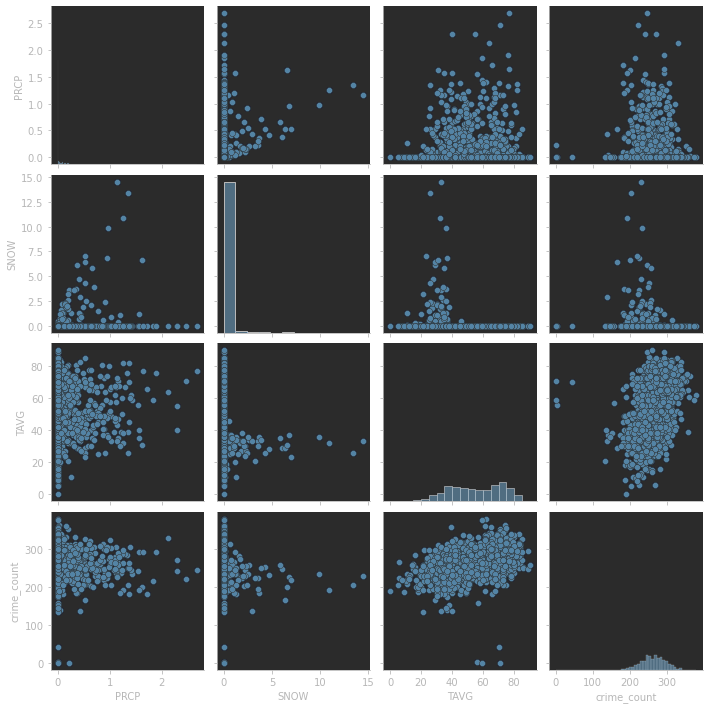
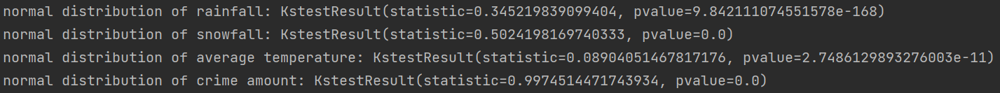
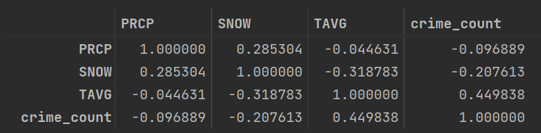
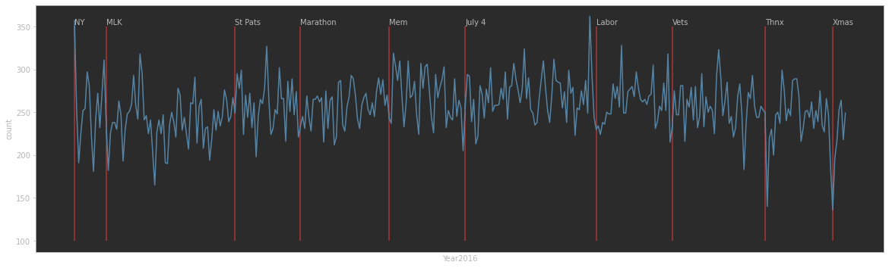
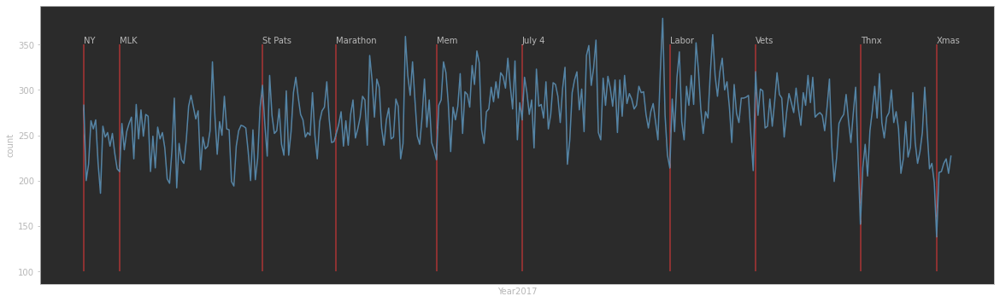
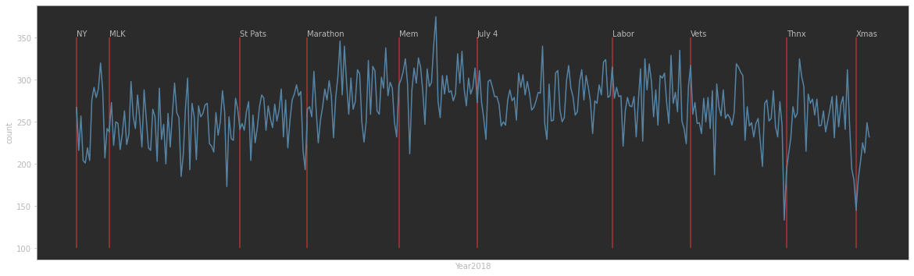
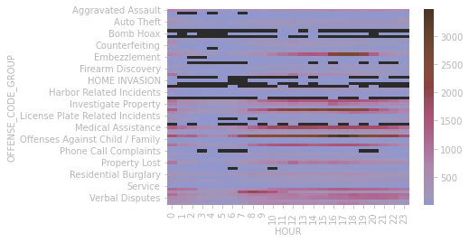
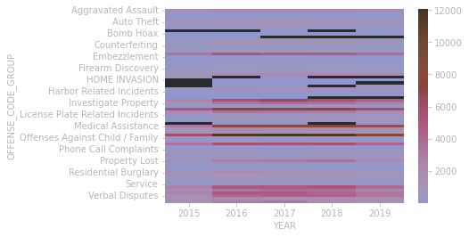
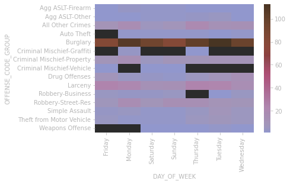

# 2022 Spring Final Project: Analysis of Crime in Boston

## Introduction

The aim of this analysis is to investigate the crime dataset of Boston. 
We are trying to find trends affecting the crime rate in this analysis.

## Usage

`hypothesis_x`:  x ranges from 1 to 4. These files are the analysis procedures of the 4 hypotheses, and they can all be run independently.

`original_work_r_to_python`: The original analysis is based on the R language and this file is where we reproduced the original analysis using Python.

`/data`: Raw data

`/prep_data`: Preprocessed data

## Hypothesis

### Hypothesis 1: Temperature and precipitation have significant impact on amount of crimes
###Preparation  
* Get weather data of Boston includes rainfall, snowfall and average temperature by day.  
* Reshape the data frame of weather data.   
* Combine modified weather data and modified crime data.
###Analysis  
Create scatter plot for a quick check.  
  
It seems that linear correlation may exist between crime amount and temperature.Before calculating related coefficient, we need to check if the data has normal distribution.  
Create function for calculating Normal distribution.  
  
The result shows P-value < 0.05, so we will use Spearman method calculating related coefficient.    
  
The related coefficient between crime amount and temperature is 0.4498 which is small.  
### Conclusion:
* Temperature and precipitation have little impact on amount of crimes.  
### Hypothesis 2: Crimes tend to increase around the holiday
###Preparation:  
* Create Functions for generate line chart with holidays labels.  
* Create list for holiday date and name by the year inputted.
* Query the crime data.  
###Analysis  
Create line chart with holiday labels.  
2016:  
  
2017:  
   
2018:  
  
The tending of crime amount seems changes randomly in most of the time.  
### Conclusion:
* Crimes tend to decrease during Christmas and Thanksgiving day.  
* Crimes don't have a specific tend in other holidays.  
### Farther thinking:  
Will the amount of various crimes change differently during hours, days or weeks?  
Heat map by hours:  
  
Heat map by days:  
  
Heat map by years:  
    
### Conclusion:
* Some types of crimes change differently while the others don't.
### Verification:  
Make verification of conclusion with data of Denver and make our conclusion more clear.    
Heat map by days:  
  
Heat map by years:  
  
The data of Denver helps us verify the conclusion that most types of crimes remain the same tend. So it leads to clear conclusions.  
##Conclusion:
* Most types of crimes remain the same tend.  
* Some types of crimes such as offenses against children/family and investigate property change differently during hours.  
### Hypothesis 3: The amount of crimes will increase as the proportion of high-income residents increases and the proportion of low-income residents decreases 

### Hypothesis 4: The crime preference location is significantly different from before during the covid epidemic and crime in residential areas has dropped significantly

## Data Source

Boston Crime: 

https://www.kaggle.com/code/queeriesimplified/boston-crime/notebook

Boston Historical Weather Data: 

https://www.noaa.gov/

Boston Building Data:

https://data.boston.gov/dataset/boston-buildings-inventory

Crime data in Denver:

https://www.kaggle.com/code/docxian/crime-evaluation/data

