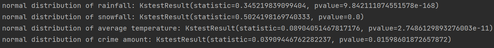
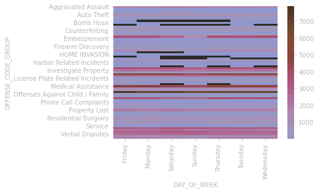
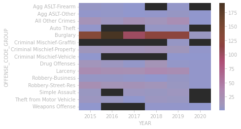
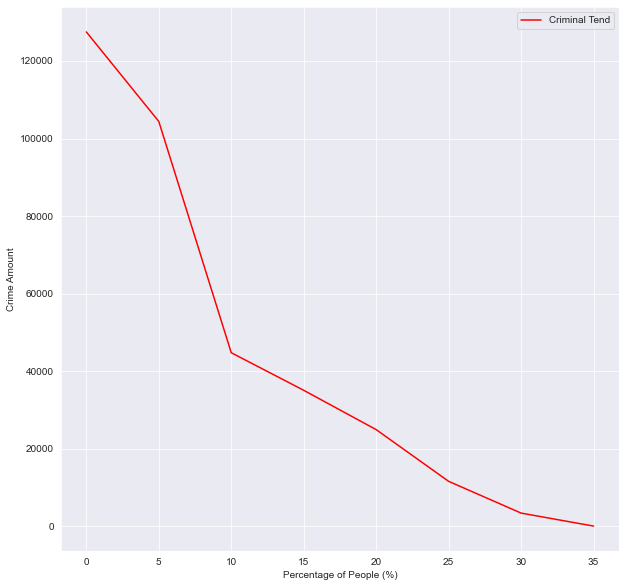
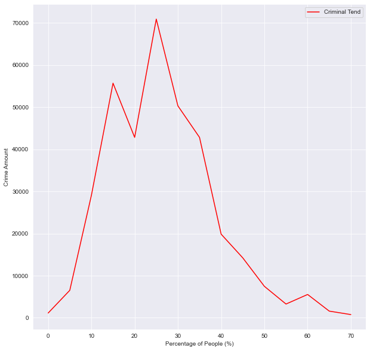
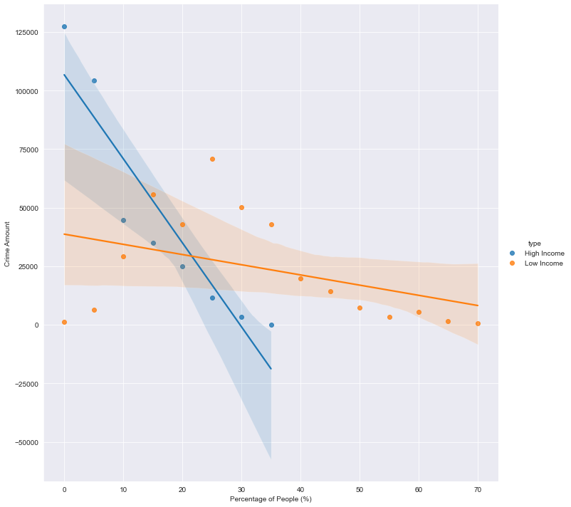
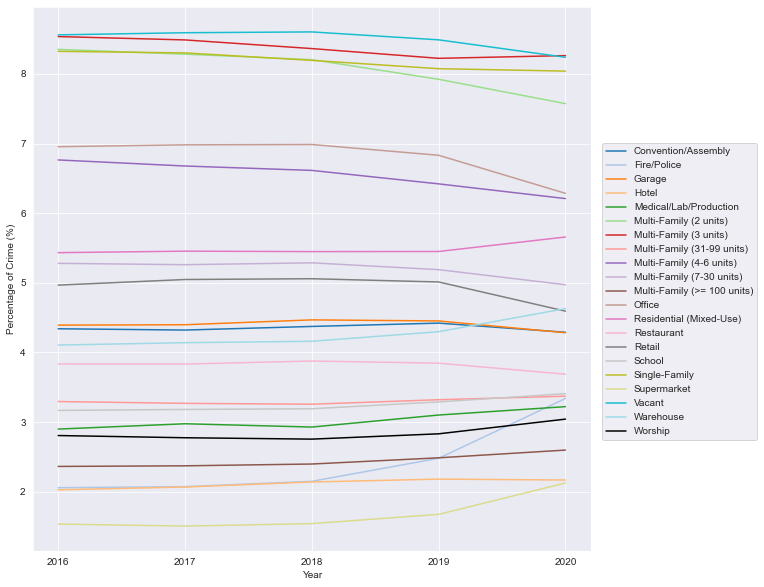
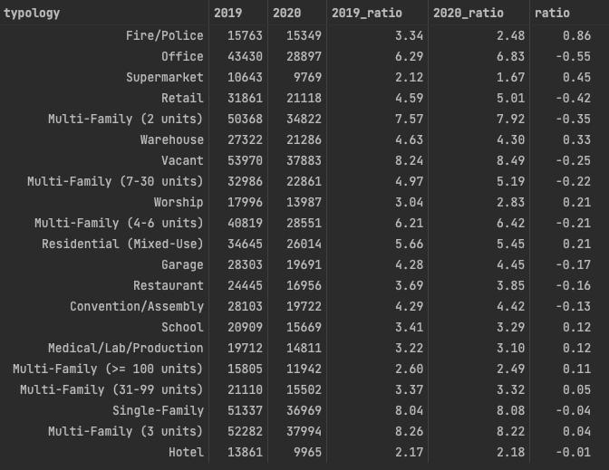
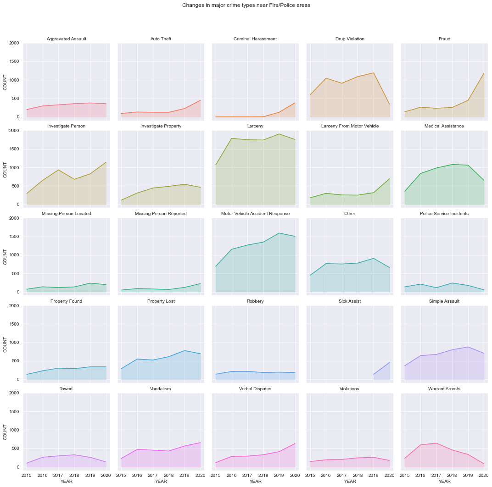

# 2022 Spring Final Project: Analysis of Crime in Boston

## Introduction

The aim of this analysis is to investigate the crime dataset of Boston. 
We are trying to find trends affecting the crime rate in this analysis.

## Usage

Download the files and run with Jupyter Notebook.

`hypothesis_x`:  x ranges from 1 to 4. These files are the analysis procedures of the 4 hypotheses, and they can all be run independently.

`original_work_r_to_python`: The original analysis is based on the R language and this file is where we reproduced the original analysis using Python.

`function_with_doctest`: Functions used in other files.

`/data`: Raw data

`/prep_data`: Preprocessed data

## Hypothesis

### Hypothesis 1: Temperature and precipitation have significant impact on amount of crimes

#### Analysis  
Create scatter plot for a quick check.  
  
It seems that linear correlation may exist between crime amount and temperature.Before calculating related coefficient, we need to check if the data has normal distribution.  
Create function for calculating Normal distribution.  
  
The result shows P-value < 0.05, so we will use Spearman method calculating related coefficient.    
  
The related coefficient between crime amount and temperature is 0.4498 which is small.  
#### Conclusion:
* Temperature and precipitation have little impact on amount of crimes.  

### Hypothesis 2: Crimes tend to increase around the holiday

#### Analysis  
Create line chart with holiday labels.  
2016:  
  
2017:  
   
2018:  
  
The tending of crime amount seems changes randomly in most of the time.  
#### Conclusion:
* Crimes tend to decrease during Christmas and Thanksgiving day.  
* Crimes don't have a specific tend in other holidays.  
#### Farther thinking:  
Will the amount of various crimes change differently during hours, days or weeks?  
Heat map by hours:  
  
Heat map by days:  
  
Heat map by years:  
    
#### Conclusion:
* Some types of crimes change differently while the others don't.
#### Verification:  
Make verification of conclusion with data of Denver and make our conclusion more clear.    
Heat map by days:  
  
Heat map by years:  
  
The data of Denver helps us verify the conclusion that most types of crimes remain the same tend. So it leads to clear conclusions.  
#### Conclusion:
* Most types of crimes remain the same tend.  
* Some types of crimes such as offenses against children/family and investigate property change differently during hours.  

### Hypothesis 3: The amount of crimes will increase as the proportion of high-income residents increases and the proportion of low-income residents decreases 

#### Analysis
By plotting the relationship between the proportion of people with different income types and the number of crimes 
in the region, it can be seen that, as the proportion of high-income people in the region increases, the number of 
crimes also gradually decreases; but when the proportion of low-income people in the region increases, the number of 
crimes first increases and then decreases, at reach the peak in the range of 15% to 30%.

#### Conclusion:
* Hypothesis is rejected. The proportion of high-income people has a significant negative correlation with the number 
of crimes, while the proportion of low-income people has no significant linear relationship with the number of crimes.

### Hypothesis 4: The crime preference location is significantly different from before during the covid epidemic and crime in residential areas has dropped significantly

#### Analysis  
 By comparing the proportion of crimes in different building topologies in different years, we can find that there 
 are indeed some fluctuations in 2020. However, the change in the specific numbers is not obvious. 
 Only Fire/Police, Office, Supermarket, and Retail rose or fell by more than 0.4%. Changes in residential 
 areas were generally less than 0.2%.

  
   

Although there is little change in the total crime volume, further analysis of this specific area of Fire/Police 
shows that there are significant changes in some categories of crime, such as Drug Violation and Fraud.
  

#### Conclusion:
* Hypothesis 4 is rejected. Based on the above analysis, we believe that pandemic has little impact on
the distribution of crimes in 2020. But within a given area, some types of crime fluctuated significantly,
such as Drug Violation's decline and Fraud's rise.

## Data Source

Boston Crime: 

https://www.kaggle.com/code/queeriesimplified/boston-crime/notebook

Boston Historical Weather Data: 

https://www.noaa.gov/

Boston Building Data:

https://data.boston.gov/dataset/boston-buildings-inventory

Crime data in Denver:

https://www.kaggle.com/code/docxian/crime-evaluation/data

